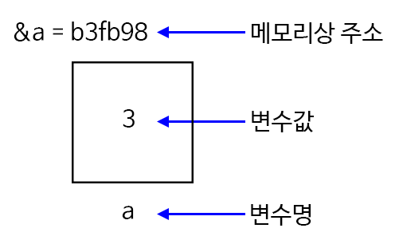
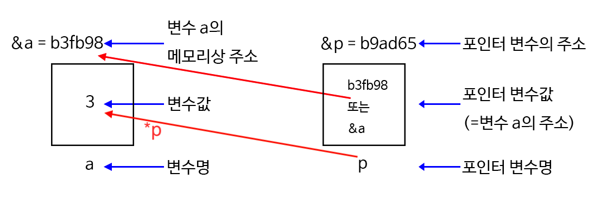
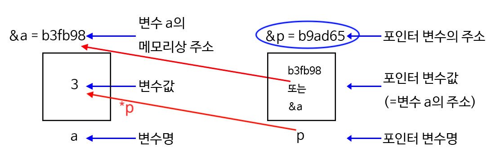
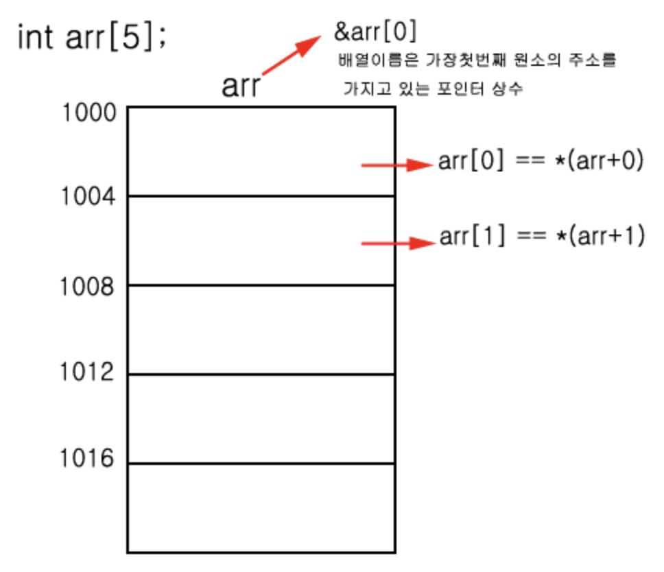

# 7장 포인터

## 핵심

* 포인터 이해

## (C 언어) 물고기 키우기

* 동영상: [(나도코딩 C) 7-1 물고기 키우기](https://www.youtube.com/watch?v=W1zcOFCGqxQ&list=PLMsa_0kAjjrdiwQykI8eb3H4IRxLTqCnP&index=44)

### 게임 설명

* 어항을 클릭해서 물 채우기

---

## (C 언어) 친구들의 주소

* 동영상: [(나도코딩 C) 7-2 친구들의 주소](https://www.youtube.com/watch?v=IxhMzEYB9L0&list=PLMsa_0kAjjrdiwQykI8eb3H4IRxLTqCnP&index=45)

* 예제: 실제 저장된 메모리상의 주소 확인하는 방법

* 앰퍼샌드(ampersand) 기호(`&`): (일반) 변수에 할당된 값이 저장된 메모리 주소를 가리킴
* 주의: 포인터 값을 받는 출력 포맷: `%p` (동영상에서 사용하는 `%d`는 경고 발생시킴)
    * 16진법으로 표현된 메모리 주소 출력

<div align="center"></div>

<그림 참조: [SOFT HIVE: C 언어 포인터](https://dasima.xyz/c-pointer/)>

---
```c
#include <stdio.h>

int main()
{
	// 포인터

	// 한 아파트에 철수, 영희, 민수 거주
	// 각각의 문 앞에 '암호'가 걸려 있음.

	// [철수]: 101호 -> 실제 메모리 공간의 주소는 다름
	// [영희]: 201호 -> 실제 메모리 공간의 주소는 다름
	// [민수]: 301호 -> 실제 메모리 공간의 주소는 다름

	int 철수 = 1;  
	int 영희 = 2;
	int 민수 = 3;

	printf("철수네 주소: %p, 암호: %d\n", &철수, 철수);
	printf("영희네 주소: %p, 암호: %d\n", &영희, 영희);
	printf("민수네 주소: %p, 암호: %d\n", &민수, 민수);
}
```

---

### Python 구현

* 파이썬에서는 포인터 변수를 굳이 사용할 필요 없음.

* 또한 변수의 주소 등을 확인할 일도 일밙거으로 없음.

---

## (C 언어) 미션맨(포인터)의 등장

* 동영상: [(나도코딩 C) 7-3 미션맨(포인터)의 등장](https://www.youtube.com/watch?v=X1LEhWth4X8&list=PLMsa_0kAjjrdiwQykI8eb3H4IRxLTqCnP&index=46)

* 두 종류의 변수 활용
    * (일반) 변수: 정수, 부동소수점, 문자, 문자열 등 값을 가리키는 변수
    * 포인터 변수: 메모리 주소를 가리키는 변수
        * (일반) 변수가 가리키는 값이 저장된 메모리 주소
        * 배열(어레이), 문자열 등이 저장된 메모리 주소

* 애스터리스크(asterisk) 기호(`*`)의 역할
    * 포인터 변수가 가리키는 주소에 저장된 값을 가리킴

<div align="center"></div>

<그림 참조: [SOFT HIVE: C 언어 포인터](https://dasima.xyz/c-pointer/)>

---
```c
	// 미션맨 등장!

	// 첫 번째 미션: 아파트의 각 집에 방문하여 문에 적힘 암호 확인

	int * 미션맨;   // 포인터 변수
	
	// 포인터 변수와, 포인터 변수가 가리키는 주소에 저장된 값 확인
	미션맨 = &철수;  // 철수의 주소
	printf("미션맨이 방문하는 곳의 주소: %p, 암호: %d\n", 미션맨, *미션맨);
	
	미션맨 = &영희;  // 영희의 주소
	printf("미션맨이 방문하는 곳의 주소: %p, 암호: %d\n", 미션맨, *미션맨);
	
	미션맨 = &민수;  // 민수의 주소
	printf("미션맨이 방문하는 곳의 주소: %p, 암호: %d\n", 미션맨, *미션맨);

	// 두 번째 미션: 각 집의 암호에 3 곱하기

	미션맨 = &철수;
	*미션맨 = *미션맨 * 3;
	printf("미션맨이 암호를 바꾼 곳의 주소: %p, 암호: %d\n", 미션맨, *미션맨);

	미션맨 = &영희;
	*미션맨 = *미션맨 * 3;
	printf("미션맨이 암호를 바꾼 곳의 주소: %p, 암호: %d\n", 미션맨, *미션맨);

	미션맨 = &민수;
	*미션맨 = *미션맨 * 3;
	printf("미션맨이 암호를 바꾼 곳의 주소: %p, 암호: %d\n", 미션맨, *미션맨);
```

---

## (C 언어) 스파이(또다른 포인터)의 등장

* 동영상: [(나도코딩 C) 7-4 스파이(또다른 포인터)의 등장](https://www.youtube.com/watch?v=Ij_XVWDRznI&list=PLMsa_0kAjjrdiwQykI8eb3H4IRxLTqCnP&index=47)

* 두 개의 포인터가 하나의 메모리 주소 공유
    * 포인터의 주요 역할임. 하지만 매우 어려운 문제 야기 가능
    * 여러 포인터 변수가 하나의 주소를 대상으로 많은 변화를 줄 수 있기 때문.

* 포인터 변수가 가리키는 주소를 저장하는 메모리 공간도 물론 따로 존재
    * 역시 앰퍼샌트 기호(`&`)를 활용하여 확인 가능

<div align="center"></div>

<그림 참조: [SOFT HIVE: C 언어 포인터](https://dasima.xyz/c-pointer/)>

---
```c
	// 스파이
	// - 두 개의 포인터가 동일한 메모리 주소를 가리킬 수 있음.
	// 미션맨이 바꾼 암호에서 2를 빼라!
	int * 스파이 = 미션맨;

	printf("\n ... 스파이가 미션 수행하는 중 ... \n\n");

	스파이 = &철수;
	*스파이 = *스파이 - 2;  // 철수 = 철수 - 2
	printf("스파이가 방문하는 곳 주소: %p, 암호: %d\n", 스파이, *스파이);

	스파이 = &영희;
	*스파이 = *스파이 - 2;  // 영희 = 영희 - 2
	printf("스파이가 방문하는 곳 주소: %p, 암호: %d\n", 스파이, *스파이);

	스파이 = &민수;
	*스파이 = *스파이 - 2;  // 민수 = 민수 - 2
	printf("스파이가 방문하는 곳 주소: %p, 암호: %d\n", 스파이, *스파이);

	// 철수, 영희, 민수는 집에 돌아와서 바뀐 암호를 보고 깜짝 놀람.
	// - 철수 제외!
	printf("철수네 주소: %p, 암호: %d\n", &철수, 철수);
	printf("영희네 주소: %p, 암호: %d\n", &영희, 영희);
	printf("민수네 주소: %p, 암호: %d\n", &민수, 민수);

	// 참고: 미션맨/포인터가 사는 곳의 주소 또한 &미션맨/&스파이 등으로 확인
	printf("미션맨의 주소: %p\n", &미션맨);
	printf("스파이의 주소: %p\n", &스파이);
```

---

## (C 언어) 배열과 포인터의 관계

* 동영상: [(나도코딩 C) 7-5 배열과 포인터의 관계](https://www.youtube.com/watch?v=MizWzX-mKfg&list=PLMsa_0kAjjrdiwQykI8eb3H4IRxLTqCnP&index=48)

* 배열을 가리키는 변수는 포인터 변수로 인식됨
* 아래 예제 코드에서 `arr`과 `ptr`은 동일한 배열을 가리킴.

---
```c
#include <stdio.h>

int main()
{
	// 배열

	int arr[3] = {5, 10, 15};
	int * ptr = arr;
	
	// 배열의 항목 확인
	for (int i = 0; i < 3; i++)
	{
		printf("배열 arr[%d]의 값: %d\n", i, arr[i]);
	}

	// 포인터로도 배열 항목 확인 가능
	for (int i = 0; i < 3; i++)
	{
		printf("포인터 ptr[%d]의 값: %d\n", i, ptr[i]);
	}

	// 포인터를 활용하여 배열 항목 수정
	ptr[0] = 100;
	ptr[1] = 200;
	ptr[2] = 300;

	// 배열 항목 다시 확인
	for (int i = 0; i < 3; i++)
	{
		printf("배열 arr[%d]의 값: %d\n", i, arr[i]);
	}

	for (int i = 0; i < 3; i++)
	{
		printf("포인터 ptr[%d]의 값: %d\n", i, ptr[i]);
	}
}
```

* 배열이 저장된 주소를 가리키는 포인터 변수는 실제로는 배열의 첫째 항목이 가리키는 메모리 주소를 가리킴.

<div align="center"></div>

<그림 참조: [SessionK 블로그: 배열 포인터연산](https://sessionk.tistory.com/156)>

---
```c
	// 포인터 값을 이용하여 아래와 같이 수정해도 동일하게 작동함
	// 포인터 변수는 어레이의 첫째 항목이 저장된 주소를 가리킴
	for (int i = 0; i < 3; i++)
	{
		printf("배열 arr[%d]의 값: %d\n", i, *(arr + i));
	}

	for (int i = 0; i < 3; i++)
	{
		printf("포인터 ptr[%d]의 값: %d\n", i, *(ptr + i));
	}

	// *(arr + i) == arr[i] 
	// arr == arr 배열의 첫번째 값의 주소와 동일, 즉, &arr[0]
	printf("arr 자체의 값: %p\n", arr);
	printf("arr[0]의 주소: %p\n", &arr[0]);

	// 배열 포인터 주소에 저장된 값 = 배열의 첫째 항목
	printf("arr 자체의 값이 가지는 주소의 실제 값: %d\n", *arr); // *(arr + 0)
	printf("arr[0]의 값: %d\n", *&arr[0]);

	// *& 는 아무 것도 없는 것과 같다. 
	// & 는 주소, * 는 그 주소에 저장된 값
	printf("arr[0]의 값: %d\n", *&*&*&arr[0]);
	printf("arr[0]의 값: %d\n", arr[0]);
```

---

### Python 구현

* 배열에 해당하는 파이썬 자료형은 리스트임.
* 하지만 또한 일반 변수로 선언해서 사용함.
* 리스트의 항목은 인덱스 활용하며, 주소값을 사용할 일이 일반적으로 없음.


```python
arr = [5, 10, 15]

for i in range(3):
    print("배열 arr[%d]의 값: %d" % (i, arr[i]));

```

    배열 arr[0]의 값: 5
    배열 arr[1]의 값: 10
    배열 arr[2]의 값: 15


* 인덱스 대신에 항목을 직접 이용하여 for 반복문 실행 가능


```python
arr = [5, 10, 15]

for item in arr:
    print(item)

```

    5
    10
    15


* 항목과 인덱스를 함께 사용하려면 `enumerate()` 함수 활용


```python
arr = [5, 10, 15]

for i, item in enumerate(arr):
    print(f"배열 arr[{i}]의 값: {item}")

```

    배열 arr[0]의 값: 5
    배열 arr[1]의 값: 10
    배열 arr[2]의 값: 15


---

## (C 언어) Swap

* 동영상: [(나도코딩 C) 7-6 Swap](https://www.youtube.com/watch?v=CchtxFktL4k&list=PLMsa_0kAjjrdiwQykI8eb3H4IRxLTqCnP&index=49)

### 두 개의 변수에 할당된 값 바꾸기 잘못된 시도

* 아래와 같이 시도하면 변수 a와 b에 저장된 값을 바꿀 수 없음.
* 이유는 swap 함수에 전달되는 것은 a와 b의 주소가 아니라 a와 b가 가리키는 값만 전달되기 때문임.

---
```c
#include <stdio.h>

// 스왑 함수
void swap(int a, int b);

int main()
{
	// Swap

	int a = 10;
	int b = 20;

	// a와 b의 값 바꾸기
	printf("Swap 함수 적용 전 => a: %d, b:%d\n", a, b);
	swap(a, b);
	printf("Swap 함수 적용 후 => a: %d, b:%d\n", a, b);
}

void swap(int a, int b)
{
	int temp = a;
	a = b;
	b = temp;
	printf("Swap 함수 내 => a: %d, b:%d\n", a, b);
}
```

* 실제로 swap 함수 본체 내에서 사용되는 변수들이 가리키는 주소가 다름.

---
```c
#include <stdio.h>

// 스왑 함수
void swap(int a, int b);

int main()
{
	// Swap

	int a = 10;
	int b = 20;
	printf("a의 주소: %p\n", &a);
	printf("b의 주소: %p\n", &b);

	// a와 b의 값 바꾸기
	printf("Swap 함수 적용 전 => a: %d, b:%d\n", a, b);
    // 값에 의한 복사(Call by Value): 값만 복사한다는 의미
	swap(a, b);
	printf("Swap 함수 적용 후 => a: %d, b:%d\n", a, b);
}

void swap(int a, int b)
{
	printf("(swap 함수 본체) a의 주소: %p\n", &a);
	printf("(swap 함수 본체) b의 주소: %p\n", &b);

	int temp = a;
	a = b;
	b = temp;
	printf("Swap 함수 내 => a: %d, b:%d\n", a, b);
}
```

* 위 코드 실행결과

```c
a의 주소: 0x7ffc1b55074c
b의 주소: 0x7ffc1b550748
Swap 함수 적용 전 => a: 10, b:20
(swap 함수 본체) a의 주소: 0x7ffc1b55071c
(swap 함수 본체) b의 주소: 0x7ffc1b550718
Swap 함수 내 => a: 20, b:10
Swap 함수 적용 후 => a: 10, b:20
```

### 두 개의 변수에 할당된 값 바꾸기: 주소값(포인터) 활용

* 스왑 함수에 변수들의 주소를 전달하면 됨.
* 이를 위해 포인터 주소를 인자로 받는 스왑함수 활용

---
```c
#include <stdio.h>

// 스왑 함수
void swap_addr(int * a, int * b);

int main()
{
	// Swap

	int a = 10;
	int b = 20;

	// a와 b의 값 바꾸기
	printf("Swap 함수 적용 전 => a: %d, b:%d\n", a, b);
	// 주소값 전달하는 방식으로
	swap_addr(&a, &b);
	printf("Swap 함수 적용 후 => a: %d, b:%d\n", a, b);
}

void swap_addr(int * a, int * b)
{
	int temp = *a;
	*a = *b;
	*b = temp;
}
```

---

### Python 구현

* 파이썬에서 두 변수에 할당된 값의 교환은 매우 간단함.


```python
a = 10
b = 20

a, b = b, a

print(f"a: {a}", f"b: {b}", sep='\n')
```

    a: 20
    b: 10


* 주의: 아래와 같이 하면 C 언어에서와 동일한 결과를 얻음.
    * 각각의 변수들이 사는 영역이 다르기 때문임.


```python
a = 10
b = 20

def swap(a, b):
    temp = a
    b = a
    a = b

swap(a, b)

print(f"a: {a}", f"b: {b}", sep='\n')
```

    a: 10
    b: 20


#### PythonTutor 활용하기

* [(파이썬) Swap](http://pythontutor.com/visualize.html#code=a%20%3D%2010%0Ab%20%3D%2020%0A%0Adef%20swap%28a,%20b%29%3A%0A%20%20%20%20temp%20%3D%20a%0A%20%20%20%20b%20%3D%20a%0A%20%20%20%20a%20%3D%20b%0A%0Aswap%28a,%20b%29%0A%0Aprint%28f%22a%3A%20%7Ba%7D%22,%20f%22b%3A%20%7Bb%7D%22,%20sep%3D'%5Cn'%29&cumulative=false&curInstr=0&heapPrimitives=nevernest&mode=display&origin=opt-frontend.js&py=3&rawInputLstJSON=%5B%5D&textReferences=false)

---

## (C 언어) 포인터로 배열 값 변경하기

* 동영상: [(나도코딩 C) 7-7 포인터로 배열 값 변경하기](https://www.youtube.com/watch?v=jYbFtxbWAzA&list=PLMsa_0kAjjrdiwQykI8eb3H4IRxLTqCnP&index=50)

* 배열의 항목을 포인터를 이용하여 수정 가능

---
```c
#include <stdio.h>

// 스왑 함수
void changeArray(int * ptr);

int main()
{
	// 배열의 2번 인덱스 값 변경하기

	int arr2[3] = {10, 20, 30};
	changeArray(arr2);

	for (int i = 0; i < 3; i++)
	{
		printf("%d\n", arr2[i]);
	}
}

void changeArray(int * ptr)
{
	ptr[2] = 50;
}
```

* `changeArray(arr2);`를 `changeArray(&arr2[0]);`로 변경 가능
* 이제 scanf 함수에서 정수를 입력받을 때 `&num` 과 같이 앰퍼샌드 기호(`&`) 사용하는 이유를 이해할 수 있음.

---

### Python 구현

* 리스트의 항목 수정은 인덱스를 활용하면 됨.


```python
arr2 = [10, 20, 30]

def changeArray(list):
    list[2] = 50
    
changeArray(arr2)

print(arr2)
```

    [10, 20, 50]


---

## (C 언어) 프로젝트

* 동영상: [(나도코딩 C) 7-8 프로젝트(전반전)](https://www.youtube.com/watch?v=_NIkHRkRTG4&list=PLMsa_0kAjjrdiwQykI8eb3H4IRxLTqCnP&index=51)
* 동영상: [(나도코딩 C) 7-9 프로젝트(후반전)](https://www.youtube.com/watch?v=S88l4zJmkNM&list=PLMsa_0kAjjrdiwQykI8eb3H4IRxLTqCnP&index=52)
* 동영상: [(나도코딩 C) 7-10 프로젝트(연장전)](https://www.youtube.com/watch?v=QePj1QvLhcc&list=PLMsa_0kAjjrdiwQykI8eb3H4IRxLTqCnP&index=53)

* 물고기 키우기 게임
    * 물고기 6마리가 각각 다른 어항에 살고 있는데 사막이다보니 너무 건조해서 물이 아주 빠르게 증발함.
    * 물이 다 증발하기 전에 어항에 물을 채워주어야 함.
    * 시간이 지날 수록 물고기 커지며, 나주에는 .... 냠냠...

---
```c
#include <stdio.h>
#include <stdlib.h>
#include <time.h>

// 물고기 6마리가 각각 다른 어항에 살고 있는데
// 사막이다보니 너무 건조해서 물이 아주 빠르게 증발함.
// 물이 다 증발하기 전에 어항에 물을 채워주어야 함.
// 시간이 지날 수록 물고기 커지며, 나주에는 .... 냠냠...

int level;
int arrayFish[6];
int * cursor;                  // 각 어항을 가리키는 역할

void initData();
void printFishes();
void decreaseWater(long elapsedTime);
int checkFishAlive();

int main(void)
{
	long startTime = 0;        // 게임 시작시간
	long totalElapsedTime = 0; // 총 경과시간
	long prevElapsedTime = 0;  // 직전 경과시간 (최근에 물을 준 시간 간격)

	int num;                   // 물을 채울 어항 번호 (사용자 입력)

	initData();

	cursor = arrayFish;        // cursor[0], cursor[1], ...

	startTime = clock();       // 현재시각을 millisecond(ms, 1000분의 1초) 단위로 변환

	while (1)                  // 문한반복
	{
		printFishes();
		printf("몇 번 어항에 물을 주시겠어요? ");
		scanf("%d", &num);

		// 입력값 체크
		if (num < 1 || num > 6)
		{
			printf("\n입력값이 잘못되었어요.\n");
			continue;
		}

		// 게임 총 경과시간
        
        // repl.it 사이트에서는 시간이 연속적으로 흐르지 않기 때문에 100으로 나누어 주는 것으로 모의실험 가능.
		totalElapsedTime = (clock() - startTime) / 100;
		// totalElapsedTime = (clock() - startTime) / CLOCKS_PER_SEC;

        printf("게임 총 경과시간: %ld 초\n", totalElapsedTime);

		// 마지막으로 물을 준 이후로 흐른 시간
		// 흐른 시간동안 증발된 물의 양을 측정하기 위함.
		prevElapsedTime = totalElapsedTime - prevElapsedTime;
		printf("마지막으로 물을 준 이후로 흐른 시간: %ld 초\n", prevElapsedTime);

		// 증발된 만큼 물을 감소시키기
		decreaseWater(prevElapsedTime);

		// 사용자가 지정한 어항에 물주기
		// 1. 어항의 물이 0이면? 물고기 이미 사망. 따라서 물 주지 않음.
		if (cursor[num-1] <= 0)
		{
			printf("%d 번 물고기는 이미 사망. 물 주지 않음.\n", num);
		}
		// 2. 어항의 물의 양이 0이 아니면 물을 줌. 단, 어항 물의 양이 100 넘지 않게 해야함.
		else if (cursor[num-1] + 1 <= 100)
		{
			// 물 주기
			printf("%d 번 어항에 물주기\n\n", num);
			cursor[num-1] += 1;
		}

		// 레벨업 시행여부 확인 (20초마다 레벨업 수행)
		if (totalElapsedTime / 20 > level - 1)
		{
			level += 1;
			printf(" *** 축 레벨업! 기존 %d 레벨에서 %d 레벨로 업그레이드 ***\n\n", level-1, level);

			// 최종레벨: 5
			if (level == 5)
			{
				printf("\n\n축하합니다. 최고레벨을 당성하였음! 게임 종료!\n\n");
				exit(0);
			}
		}

		// 물고기가 죽었는지 확인하기
		if (checkFishAlive() == 0)
		{
			// 모든 물고기 모두 사망
			printf("모든 물고기 사망 ㅠㅠ\n");
			exit(0);
		}
		else
		{
			printf("물고기 아직 살아 있음!\n");
		}
		
		// while 문이 반복될 때마다 마지막에 물준 시간 기억하기
		// prevElapsedTime 이미 그 역할 다했기 때문에 여기서 업데이트 해도 문제 없음.
		prevElapsedTime = totalElapsedTime;
	}

	return 0;
}

void initData()
{
	level = 1;                 // 게임 시작 레벨 (1-5)
	
	for (int i = 0; i < 6; i++)
	{
		arrayFish[i] = 100;     // 최초 어항 물높이 
	}
}

void printFishes()
{
	printf("\n");
	printf("%3d번 %3d번 %3d번 %3d번 %3d번 %3d번\n", 1, 2, 3, 4, 5, 6);
	for (int i = 0; i < 6; i++)
	{
		printf(" %4d ", arrayFish[i]);
	}
	printf("\n\n");
}

void decreaseWater(long elapsedTime)
{
	for (int i = 0; i < 6; i++)
	{
		arrayFish[i] -= (level * 3 * (int)elapsedTime); // 3은 난이도 조절용

		// 물의 최소량은 0임.
		if (arrayFish[i] < 0)
		{
			arrayFish[i] = 0;
		}
	}
}

int checkFishAlive()
{
	for (int i = 0; i < 6; i++)
	{
		if (arrayFish[i] > 0)
			return 1; // 참 True
	}

	return 0;
}

```
---

### 특징

* 포인터 변수 `cursor`를 굳이 사용해야 하는 이유가 확실하지 않음.
* `cursor` 대신에 `arrayFish` 변수를 그대로 사용해도 되기 때문임.

---

### Python 구현


```python

```

---
